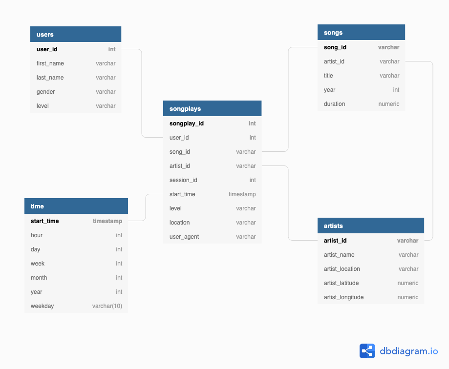

# Project 1 - Data Modeling with Postgres

## Purpose:

The purpose of this project is to create an ETL pipeline to enable the Sparkify analytics team to utilise song and user activty logs captured from our new music streaming app so as to better understand our users and support future app updates/business decisions.

## Running:

In the scripts folder:  
**Option 1**: Run a single script to re-intialise the Postgres tables and run etl2 script to batch process and import the .json files
In the command line , execute:

1.  "bash run.bash"

**Option 2**: Individually run each script. Note each file needs to be run in the order listed below.
In the command line, execute:

1. "python create_tables.py"
2. "python etl2.py" for batch import or "python etl.py" for row by row import

## File Descriptions:

sql_queries.py: This file defines all the Postgres table creation, import (for etl.py) and drop statements to create the following tables: 

- songplays  
- users  
- artists  
- song  
- time  

create_tables.py: This scipt connects to the database, re-initialises the sparkifydb database if it exists, ensures all the tables are dropped from the database and then creates the tables defined in the sql_queries.py file.

etl.py: This script contains the etl pipeline where the song_data and log_data files are ingested using the Pandas read_json function, formatted to match the relevant Postrgres table format and cleaned (only datatype and removal of entries that are not complete, ie. have None/NaN values) and imported into the applicable table in the sparkifydb. Note this script processes each file individually and updates the Postgres tables using the sql_queries IMPORT statements, row by row. For an improved bulk import script, use etl_advanced.py

etl2.py: This script performs the same function as etl.py except all song_data and log_data files are loaded into a Pandas DataFrame, individual DataFrames are then created for each Postgres table before data cleaning and then a bulk import using the psycopg2 copy_from routine.

etl.ipynb: Working notebook to test methodology and develop functions used in etl.py. There is no associated Jupyter Notebook for the updated approach for bulk imports utilised by etl2.py.

test.ipynb: Testing notebook compatible with the Udacity workspace to verify Postgres tables have been loaded and updated correctly.

test2.ipynb: Testing notebook modified to work on local system with a local Postgres instance installed to verify Postgres tables have been loaded and updated correctly.

Queries_Demos.ipynb: Notebook of demo queries using available data. A number of these queries and sample results have been included below in the Queries section

## Relational Database Structure

Based upon the available data and needs of Sparkify, the following Postgres database design was utilised containing one Fact Table (songplays) and four Dimension Tables (users, artists, songs and time). The Star Schema representation is shown below.  

The tables were generated as per the Project specification. It is noted that they are almost normalised, with the exception of 'level' not being a primary key in the users table, yet being duplicated in the songplays table. This duplication should be investigated further with the view to remove 'level' from the songplays table to avoid duplication.

## Queries

Due to the limited dataset currently provided, the usefulness of the songplays table cannot be fully exploited to identify popular songs by day, time or region. The following queries
have been developed to help the analytics team whilst further data collection and augmentation is conducted.

<ol>
<li>Number of songplays by day of week for 'free' level users:

        days = ['Monday','Tuesday','Wednesday','Thursday','Friday','Saturday','Sunday']
        count = []

        for i, day in enumerate(days):
            cur.execute("""SELECT COUNT(*) FROM songplays JOIN time ON
                        songplays.start_time = time.start_time WHERE time.weekday = %s
                        AND songplays.level = 'free';""",(day,))
            count.append(cur.fetchall()[0][0])

        count_by_day_free = dict(zip(days,count))

</li>

**Sample Results**:

|           | Songplays |
| --------- | --------- |
| Monday    | 201       |
| Tuesday   | 199       |
| Wednesday | 195       |
| Thursday  | 148       |
| Friday    | 257       |
| Saturday  | 108       |
| Sunday    | 121       |

<li>Number of songplays by day of week for 'paid' level users:

        days = ['Monday','Tuesday','Wednesday','Thursday','Friday','Saturday','Sunday']
        count = []

        for i, day in enumerate(days):
            cur.execute("""SELECT COUNT(*) FROM songplays JOIN time ON
                        songplays.start_time = time.start_time WHERE time.weekday = %s
                        AND songplays.level = 'paid';""",(day,))
            count.append(cur.fetchall()[0][0])

        count_by_day_paid = dict(zip(days,count))

</li>

**Sample Results**:

|           | Songplays |
| --------- | --------- |
| Monday    | 813       |
| Tuesday   | 872       |
| Wednesday | 1169      |
| Thursday  | 904       |
| Friday    | 1038      |
| Saturday  | 520       |
| Sunday    | 275       |

<li>Number of unique users by day of week for 'free' level:

        days = ['Monday','Tuesday','Wednesday','Thursday','Friday','Saturday','Sunday']
        count = []

        for i, day in enumerate(days):
            cur.execute("""WITH unique_users AS (SELECT DISTINCT on (user_id) user_id,
                        location, level, time.weekday FROM songplays JOIN time
                        ON songplays.start_time = time.start_time WHERE level = 'free' AND weekday = %s)
                        SELECT COUNT (*) as count_all FROM unique_users;""",(day,))
            count.append(cur.fetchall()[0][0])
        unique_users_by_day_free = dict(zip(days,count))

</li>

**Sample Results**:

|           | Songplays |
| --------- | --------- |
| Monday    | 47        |
| Tuesday   | 45        |
| Wednesday | 50        |
| Thursday  | 45        |
| Friday    | 52        |
| Saturday  | 36        |
| Sunday    | 35        |

<li> Number of unique users by day of week for 'paid' level:

        days = ['Monday','Tuesday','Wednesday','Thursday','Friday','Saturday','Sunday']
        count = []

        for i, day in enumerate(days):
            cur.execute("""WITH unique_users AS (SELECT DISTINCT on (user_id) user_id, location,
                        level, time.weekday FROM songplays JOIN time
                        ON songplays.start_time = time.start_time WHERE level = 'paid' AND weekday = %s)
                        SELECT COUNT (*) as count_all FROM unique_users;""",(day,))
            count.append(cur.fetchall()[0][0])
        unique_users_by_day_paid = dict(zip(days,count))

</li>

**Sample Results**:

|           | Songplays |
| --------- | --------- |
| Monday    | 16        |
| Tuesday   | 16        |
| Wednesday | 16        |
| Thursday  | 14        |
| Friday    | 16        |
| Saturday  | 11        |
| Sunday    | 6         |

<li>Top 3 locations by total songplays:

        cur.execute("""SELECT COUNT(*) as count_all, songplays.location as location FROM songplays
                    GROUP BY songplays.location ORDER BY count_all DESC LIMIT 3;")
        top3_locations_by_songplays = cur.fetchall()

</li>

**Sample Results**:

| Rank | Unique Users | Location                          |
| ---- | ------------ | --------------------------------- |
| 1    | 691          | San Francisco-Oakland-Hayward, CA |
| 2    | 665          | Portland-South Portland, ME       |
| 3    | 557          | Lansing-East Lansing, MI          |

<li>Top 3 locations by unique users:

        cur.execute("""WITH unique_users AS (SELECT DISTINCT on (user_id) user_id, location,
                    level  FROM songplays)  SELECT COUNT (*) as count_all, unique_users.location
                    FROM unique_users GROUP BY unique_users.location ORDER BY count_all DESC LIMIT 3;""")
        top3_locations_by_unique_users = cur.fetchall()

</li>

**Sample Results**:

| Rank | Unique Users | Location                              |
| ---- | ------------ | ------------------------------------- |
| 1    | 10           | New York-Newark-Jersey City, NY-NJ-PA |
| 2    | 4            | Houston-The Woodlands-Sugar Land, TX' |
| 3    | 3            | Chicago-Naperville-Elgin, IL-IN-WI    |

<li>Top 3 locations by total songplays for each day of week:

        days = ['Monday','Tuesday','Wednesday','Thursday','Friday','Saturday','Sunday']
        top3 = []

        for i, day in enumerate(days):
            cur.execute("""SELECT COUNT(*) as count_all, songplays.location as location FROM songplays
                        JOIN time ON songplays.start_time = time.start_time WHERE time.weekday = %s
                        GROUP BY songplays.location ORDER BY count_all DESC LIMIT 3;",(day,))
            top3.append(cur.fetchall())

        top3_locations_by_day = dict(zip(days,top3))

</li>

**Sample Results**:

|           | Songplays | Location                            |
| --------- | --------- | ----------------------------------- |
| Monday    | 152       | Lake Havasu City-Kingman, AZ        |
|           | 114       | Waterloo-Cedar Falls, IA            |
|           | 99        | Tampa-St. Petersburg-Clearwater, FL |
| Tuesday   | 150       | Lansing-East Lansing, MI            |
|           | 106       | Atlanta-Sandy Springs-Roswell, GA   |
|           | 97        | San Francisco-Oakland-Hayward, CA   |
| Wednesday | 224       | Chicago-Naperville-Elgin, IL-IN-W   |
|           | 193       | Lansing-East Lansing, MI            |
|           | 181       | Portland-South Portland, ME         |
| Thursday  | 142       | San Francisco-Oakland-Hayward, CA   |
|           | 140       | Portland-South Portland, ME         |
|           | 127       | San Jose-Sunnyvale-Santa Clara, CA  |
| Friday    | 183       | San Francisco-Oakland-Hayward, CA   |
|           | 158       | Portland-South Portland, ME         |
|           | 137       | Janesville-Beloit, WI               |
| Saturday  | 97        | Winston-Salem, NC                   |
|           | 96        | Tampa-St. Petersburg-Clearwater, FL |
|           | 80        | San Francisco-Oakland-Hayward, CA   |
| Sunday    | 119       | Atlanta-Sandy Springs-Roswell, GA   |
|           | 54        | Waterloo-Cedar Falls, IA            |
|           | 37        | San Francisco-Oakland-Hayward, CA   |

<li> Top 3 paid users by total number of songs played:

        cur.execute("""SELECT COUNT (*) as count_all,  users.first_name, users.last_name, users.gender
                    FROM songplays JOIN users ON songplays.user_id = users.user_id
                    WHERE songplays.level = 'paid' GROUP BY first_name, last_name, gender
                    ORDER BY count_all DESC LIMIT 3;""")
        top3_paid_users_by_songplays = cur.fetchall()

</li>

**Sample Results**:

| Rank | Songplays | First Name | Last Name | Gender |
| ---- | --------- | ---------- | --------- | ------ |
| 1    | 650       | Chloe      | Cuevas    | F      |
| 2    | 648       | Tegan      | Levine    | F      |
| 3    | 557       | Kate       | Harrell   | F      |

</ol>

## OPPORTUNITIES FOR IMPROVEMENT

<ol>
<li> Don't throw away as much data during cleaning
    e.g. 
    - Where artist_latitude and/or artist_longitude are missing but artist_location is given, use a service like Google Maps API to get coordinates based upon artist_location
    - Where year is missing from the songs dataset (shown as 0 in dataset), utilise another data source to search from missing year data based upon artist and song name</li>
<li> Further refactor code to reduce repetition of code blocks
    e.g. creating initial dataframe and potentially basic data cleaning could be handled by a function rather than writing the same/similar code in process_song_files and process_log_files</li>
<li> Formatting of query outputs into a more reportable/aesthetic format
    This would be dependent upon how the analytics team is going to use the data (e.g. dashboard or in an excel report)
    </li>
