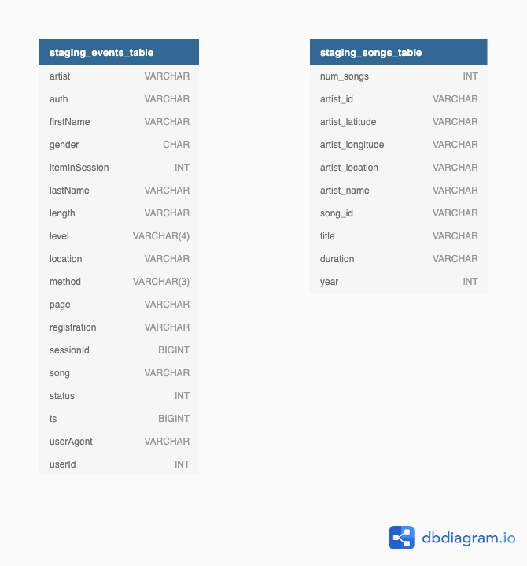

# Project 3 - Data Warehouse

## Purpose:

The purpose of this project is to establish a Data Warehouse on AWS and create an ETL pipeline to enable the Sparkify analytics team to utilise song and user activty logs captured from our new music streaming app so as to better understand our users and support future app updates/business decisions.

## Running:

In the scripts folder:  
**Option 1**: Redshift cluster already running  
In the command line , execute:

1.  "python create_tables.py"
2.  "python etl.py"

**Option 2**: Redshift cluster not running

1. "python launch_dwh.py"
2. "python create_tables.py"
3. "python etl.py"

If you want to shutdown the Redshift cluster (NOTE THIS WILL DELETE THE CLUSTER AND ALL RECORDS, NO SNAPSHOT IS TAKEN)

1.  "python shutdown_dwh.py"

## File Descriptions:

sql_queries.py: This file defines all the table creation, data cleaning of staging tables, import (for etl.py) and drop statements to create the following tables: 

- staging_events_table  
- staging_songs_table  
- fact_songplays  
- dim_users  
- dim_artists  
- dim_song  
- dim_time  

create_tables.py: This script connects to the Redshift database, ensures all the tables are dropped from the database and then creates the tables defined in the sql_queries.py file.

etl.py: This script contains the etl pipeline where the JSON song_data and log_data files located in the company S3 Bucket are ingested into staging tables and cleaned (only removal of entries that are blank, NULL or 'None'). Fact and Dimension tables are then populated from the cleaned staging tables.

launch_dwh.py: This script launches Redshift cluster defined in dwh_notebook.cfg (not included on Github repository) and outputs host and arn to log.cfg for use by etl.py to connect to the Redshift database.

shutdown_dwh.py: This script shuts down the existing Redshift cluster and deletes created resources. Script keeps running until cluster deletion is confirmed. No cluster snapshot is taken. ANY DATA RESIDING ON THE CLUSTER WILL BE LOST.

Dataset Exploration.ipynb: Jupyter notebook to test the data warehouse creation procedures, explore the data in the S3 Bucket and test table creation, cleaning and population routines to ensure correct loading and ensure no duplicate records are loaded to the Fact and Dimension tables.

Queries_Demos.ipynb: Notebook of demo queries using available data. Requires the Redshift cluster to be running and etl.py to have been executed successfully.

## Staging Tables

As an intermediate step, the JSON log and song files are initially loaded into staging_events_table and staging_songs_table respectively. Basic data integrity/cleaning checks are made prior to loading the data into the Fact and Dimension tables. It was noted that during COPY execution, values imported into columns with NUMERIC/FLOAT/DOUBLE data types were not being loaded correctly and therefore these were reverted to VARCHAR datatypes and then cast during the ingestion step to the correct type.

Note: After data cleaning routines, start_time (TIMESTAMP) is added to staging_events_table; start_time is then referenced for table population and original ts column is no longer used.

## Relational Database Structure

Based upon the available data and needs of Sparkify, the following Postgres database design was utilised containing one Fact Table (songplays) and four Dimension Tables (users, artists, songs and time). The Star Schema representation is shown below.  

The tables were generated as per the Project specification. It is noted that they are almost normalised, with the exception of 'level' not being a primary key in the users table, yet being duplicated in the songplays table. This duplication should be investigated further with the view to remove 'level' from the songplays table to avoid duplication.

#### Sort Keys & Foreign Keys

dim_time.start_time, dim_users.level, dim_songs.year have been set as sortkeys.
user_id, song_id, artist_id and start_time have been set a foreign keys in the fact_songplays table creation.

## OPPORTUNITIES FOR IMPROVEMENT

<ol>
<li> Further investigate security and TCP port creation to improve efficiency of routine and ensure security/integrity of Sparkify data.</li>
<li> Don't throw away as much data during cleaning
    e.g. 
    - Where artist_latitude and/or artist_longitude are missing but artist_location is given, use a service like Google Maps API to get coordinates based upon artist_location
    - Where year is missing from the songs dataset (shown as 0 in dataset), utilise another data source to search from missing year data based upon artist and song name</li>
<li> Reduce repetition in the data cleaning step by creating a function</li>
<li> Create a dashboard that connects directly to the Redshift cluster to make execution of Sparkify analytics queries easier.</li>
<li> Further investigation of frequent queries to optimise queries and database design as the database grows</li>
<li> Further explore use of sort keys </li>
