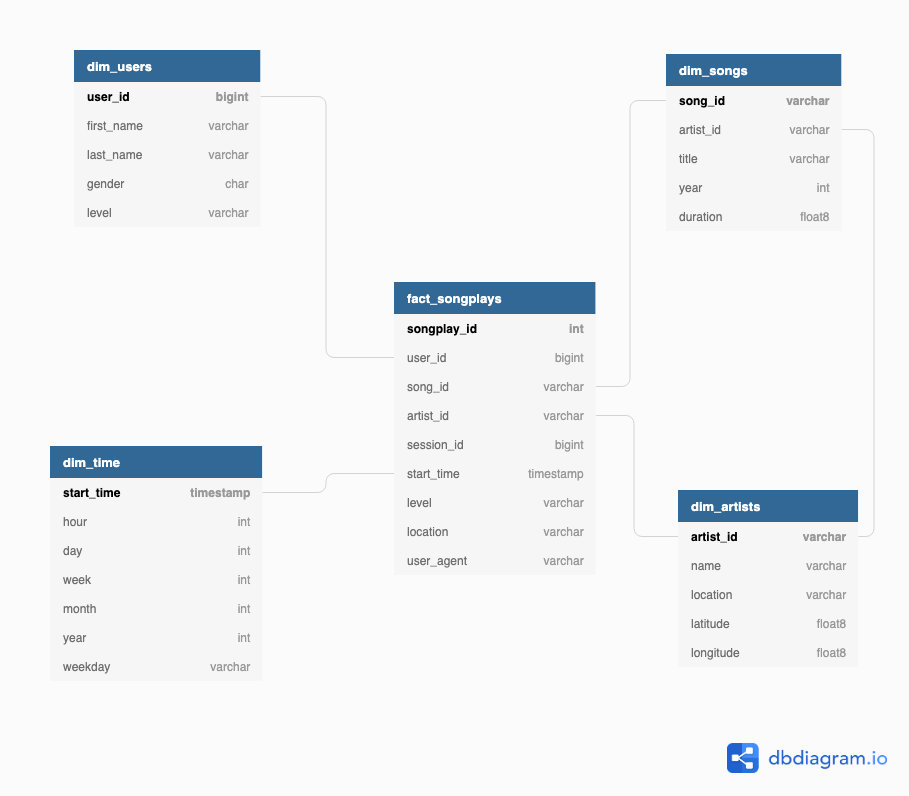

# Project 4 - Data Lake

## Purpose:

The purpose of this project is to establish a Data Lake on AWS and create an ETL pipeline to enable the Sparkify analytics team to utilise song and user activty logs captured from our new music streaming app so as to better understand our users and support future app updates/business decisions.

## Running:

- Recommendation is that this script is executed on an AWS EMR cluster. An example script to launch an EMR cluster is included in the Launch_EMR folder.
- Requires an S3 bucket to be running and defined in etl.py for the output tables to be saved to.
- AWS access key and secret key required in a file called dl.cfg prior to executing script. Required format is in dl.cfg.template

with the dl.cfg and etl.py copied onto your EMR host:

'spark-submit etl.py'

## File Descriptions:

etl.py: This script contains the etl pipeline where the JSON song_data and log_data files located in the company S3 Bucket are ingested, processed into Fact and Dimension tables and then saved as parquet files to S3.

dl.cfg.template: Template for AWS access key and secret key format to be saved as dl.cfg in the same location as etl.py to enable access to S3 buckets.

Spark_Data_Exploration.ipynb: Jupyter notebook explore the sample dataset and develop spark scripts to generate Fact and Dimension tables and save as parquet files. All data processing is done on the local drive and sample song and log event data mirroring the S3 file structure is required.

create_project_emr.sh: Bash script to launch and EMR cluster programmatically.

## Relational Database Structure

Based upon the available data and needs of Sparkify, the following Postgres database design was utilised containing one Fact Table (songplays) and four Dimension Tables (users, artists, songs and time). The Star Schema representation is shown below.  

## Opportunities For Improvement:

<ol>
<li> Generate a dashboard that visualise popular Sparkify Analytics Team queries from the S3 bucket parquet files</li>
<li> Implement data cleaning in the etl.py script.</li>
</ol>
