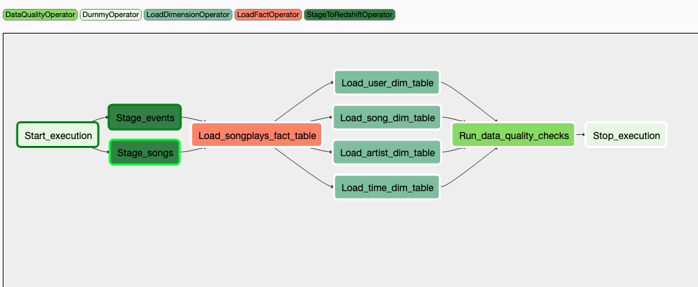
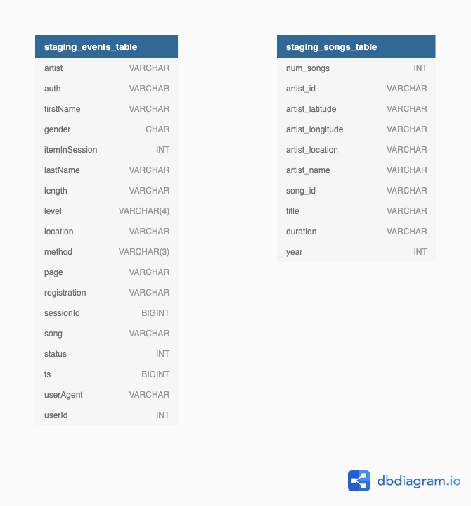
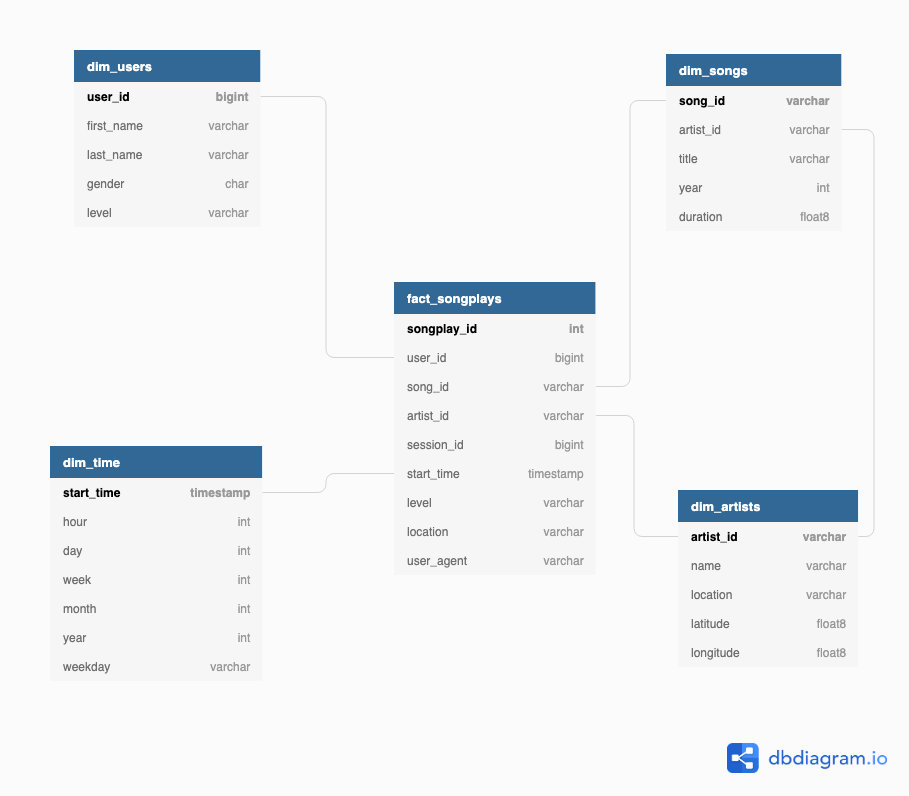

# Project 5 - Data Pipelines with Airflow

## Purpose:

The purpose of this project is to establish a Data Pipeline using Airflow to automate the ETL process on AWS to create reliable, fresh data analytics tables to support Sparkify analytics team better understand our users and support future app updates/business decisions.

## Setup / Running:

### DAG and Operator files

- Ensure dags, helper and custom operators (along with their _init_.py files) are in their respective folders of the Airflow instance being used.

### Create Connections

- Prior to running the 'sparkify_dag' DAG, ensure the following connections have been setup:

  
Source: Udacity Data Engineering Course Notes

1.  aws_credentials:  
    **Conn Id**: Enter aws_credentials.  
    **Conn Type**: Enter Amazon Web Services.  
    **Login**: Enter your Access key ID from the IAM User credentials.  
    **Password**: Enter your Secret access key from the IAM User credentials.

  
Source: Udacity Data Engineering Course Notes

2.  redshift:  
    **Conn Id**: Enter redshift.  
    **Conn Type**: Enter Postgres.  
    **Host**: Enter the endpoint of your Redshift cluster, excluding the port at the end. You can find this by selecting your cluster in the Clusters page of the Amazon Redshift console. See where this is located in the screenshot below. IMPORTANT: Make sure to NOT include the port at the end of the Redshift endpoint string.  
    **Schema**: Enter dev. This is the Redshift database you want to connect to.  
    **Login**: Enter awsuser.  
    **Password**: Enter the password you created when launching your Redshift cluster.  
    **Port**: Enter 5439.

Note: The redshift cluster needs to be created in the same region as the S3 bucket being used.

## DAG Descriptions:

**Start_execution**: Dummy operation representing the start of the dag. In the future this could be used to run checks on whether the dag needs to be run. For example, check if there is new data that needs processing and if not log and skip.

**Stage_events**: This operation uses the StageToRedshiftOperator to copy all log events in json format from the S3 bucket into table staging_events. Basic data cleaning can be conducted at this stage by making clean_data flag as True and passing in the specific queries.

**Stage_songs**: This operation uses the StageToRedshiftOperator to copy all song details in json format from the S3 bucket into table staging_songs. Basic data cleaning can be conducted at this stage by making clean_data flag as True and passing in the specific queries.

**Load_songplays_fact_table**: This operation uses the LoadFactOperator to populate the Songplays fact table from the staging tables.

**Load_user_dim_table**: This operation uses the LoadDimensionOperator to populate the User dimension table from the stagin tables. The truncate_mode flag allows the toggling between append & truncate modes if the table already exists in Redshift.

**Load_song_dim_table**: This operation uses the LoadDimensionOperator to populate the Song dimension table from the stagin tables. The truncate_mode flag allows the toggling between append & truncate modes if the table already exists in Redshift.

**Load_artist_dim_table**: This operation uses the LoadDimensionOperator to populate the Artist dimension table from the stagin tables. The truncate_mode flag allows the toggling between append & truncate modes if the table already exists in Redshift.

**Load_time_dim_table**: This operation uses the LoadDimensionOperator to populate the Time dimension table from the stagin tables. The truncate_mode flag allows the toggling between append & truncate modes if the table already exists in Redshift.

**Run_data_quality_checks**: This operation uses the DataQualityOperator to run data quality checks on the fact and dimension tables. The test queries and expected results need to be defined in data_checking.py contained in the helper folder.

**Stop_execution**: This is a dummy operation representing the end of the dag. In the future some custom reporting or logging tasks could be initiated here.

Inputs for the custom operators are defined in the plugins/operators README.

## Staging Tables

## Relational Database Structure

## OPPORTUNITIES FOR IMPROVEMENT / UPDATES

<ol>
<li> Update the StageToRedshiftOperator to use the execution_date to only read in the relevant log file for processing </li>
<li> Update the quality checks being run </li>
<li> Add process to save the fact and dimension tables back into S3 for the analytics team to use. </li>
<li> Add a check to StageToRedshiftOperator so that if log files are missing for a specific date, it skips the remainder of the dag processing </li>
<li> Investigate how updates to missing data can be handled by the dag to automatically check for and include it in the processsed tables if found. i.e. If a log file from last week was added, it gets detected and processed in the next run of the dag. </li>  
<li>  Change DataQualityOperator to force failure of the dag if the data checks fail.  Currently the operator still defaults to the retry policy, prolonging the completion of the dag.
</ol>
