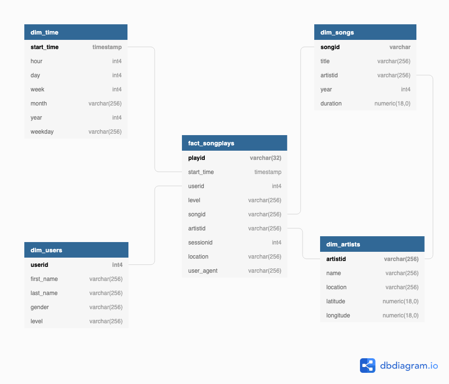

# Project 5 - Data Pipelines with Airflow

## Purpose:

The purpose of this project is to establish a Data Pipeline using Airflow to automate the ETL process on AWS to create reliable, fresh data analytics tables to support Sparkify analytics team better understand our users and support future app updates/business decisions.

## Running:

### DAG and Operator files

- Ensure dags, helper and custom operators (along with their _init_.py files) are in their respective folders of the Airflow instance being used.

### Create Connections

- Prior to running the 'sparkify_dag' DAG, ensure the following connections have been setup:

  

1.  aws_credentials:  
    Conn Id: Enter aws_credentials.
    Conn Type: Enter Amazon Web Services.
    Login: Enter your Access key ID from the IAM User credentials.
    Password: Enter your Secret access key from the IAM User credentials.

  

2.  redshift:  
    Conn Id: Enter redshift.
    Conn Type: Enter Postgres.
    Host: Enter the endpoint of your Redshift cluster, excluding the port at the end. You can find this by selecting your cluster in the Clusters page of the Amazon Redshift console. See where this is located in the screenshot below. IMPORTANT: Make sure to NOT include the port at the end of the Redshift endpoint string.
    Schema: Enter dev. This is the Redshift database you want to connect to.
    Login: Enter awsuser.
    Password: Enter the password you created when launching your Redshift cluster.
    Port: Enter 5439.

Note: The redshift cluster needs to be created in the same region as the S3 bucket being used.  
  
   

## File Descriptions:

[To be Updated]

## Staging Tables

As an intermediate step, the JSON log and song files are initially loaded into staging_events_table and staging_songs_table respectively. Basic data integrity/cleaning checks are made prior to loading the data into the Fact and Dimension tables.

Note: After data cleaning routines, start_time (TIMESTAMP) is added to staging_events_table; start_time is then referenced for table population and original ts column is no longer used.

## Relational Database Structure

Based upon the available data and needs of Sparkify, the following Postgres database design was utilised containing one Fact Table (songplays) and four Dimension Tables (users, artists, songs and time). The Star Schema representation is shown below.  

The tables were generated as per the Project specification. It is noted that they are almost normalised, with the exception of 'level' not being a primary key in the users table, yet being duplicated in the songplays table. This duplication should be investigated further with the view to remove 'level' from the songplays table to avoid duplication.

## OPPORTUNITIES FOR IMPROVEMENT

<ol>
<li> XXX </li>
</ol>
